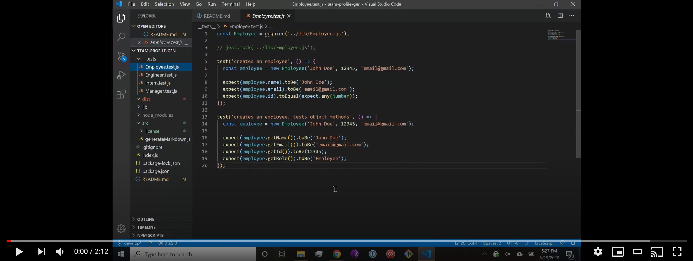

# Team Profile Generator 

## Description
This application can be used to render a styled webpage consisting of team members entered through a CLI.

## Table of Contents
* [Installation](#Installation)
  
* [Usage](#Usage)

* [License](#License)

* [Questions](#Questions)

## Installation
Installation instructions listed below:
```
npm install
```
  
## Usage
After running npm install, run node index from its parent directory to start the program. Answer any questions when prompted, and look for team.html in the dist directory to find your finished webpage.
[](https://www.youtube.com/embed/qCL4IddShHU)

## License
A short and simple permissive license with conditions only requiring preservation of copyright and license notices. Licensed works, modifications, and larger works may be distributed under different terms and without source code.

To view the full license, [click here](./src/license/MIT.txt).

## Questions
If you have any questions, you can find me at [aelisker](https://github.com/aelisker) and via email at [alisker@protonmail.com](mailto:alisker@protonmail.com).
    